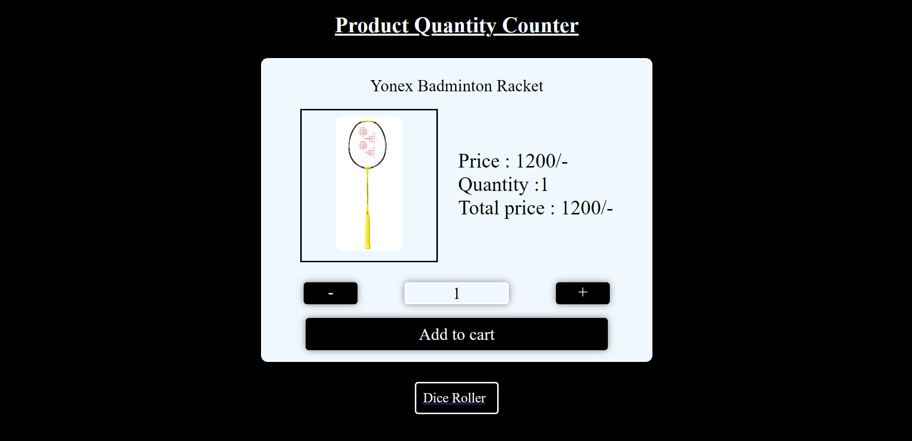

# Quantity Counter & Dice Roller

This repository contains two web-based tools:

1. **Product Quantity Counter**: A tool to manage and display product quantities and total price.
2. **Dice Roller**: A simple dice roller that displays random dice faces.

## Screenshots

### Product Quantity Counter

*Description: The Product Quantity Counter tool displays a product with an adjustable quantity and calculates the total price.*

### Dice Roller

*Description: The Dice Roller tool allows you to roll a dice, changing the dice face image to show a random result.*
